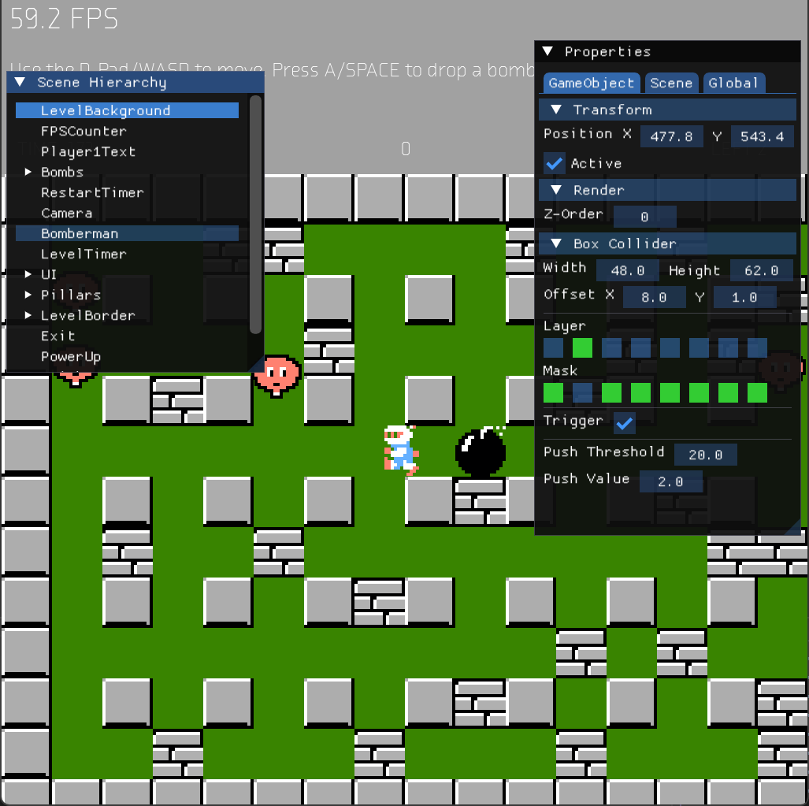

# Minigin
This project contains a 2D game engine in C++, and a remake of Bomberman. This project was created for educational purposes, as part of a Programming 4 course at Howest DAE.

## Source Control
The project used GitHub throughout its development.

https://github.com/YoranSchoonooghe/minigin

# Bomberman
Bomberman is a classic NES game originally released in 1985. Players navigate grid-based levels, and must strategically place bombs to destroy obstacles, defeat enemies, and find the exit. This remake implemented some, but not all of its features, and contains 3 stages.

  

Play the game in browser [here](https://yoranschoonooghe.github.io/minigin/). 

### Game Modes
There are 3 game modes, being single player, multiplayer co-op, and a versus mode.

### Enemies
The remake contains 4 of its original enemies, which are: 

- Balloom
- Oneal
- Doll
- Minvo

Each enemy type varies in its movement speed, its enemy AI behavior, and contributes to a different score. The first stage only contains Balloom enemies, while the second stage also has Oneal enemies. The third stage introduces both the Doll and Minvo enemy types.

### Power-ups
Each stage has a different power-up, which is revealed by destroying bricks. The 3 power-ups I implemented are:

- Flames: this power-up gives extended range to the explosion of a bomb
- Extra Bomb: allows the player to drop multiple bombs simultaneously
- Detonator: allows the player to detonate bombs instead of a timer-based explosion

### High Score
Additionally, the game contains a high score system. When the player reaches the end of stage 3, or when the player lost all lives, the game checks if their score is high enough to be among the high scores. If so, the player can enter their name to make it to the leaderboard.

# Engine
The engine started from Minigin, a very small project using [SDL3](https://www.libsdl.org/) and [glm](https://github.com/g-truc/glm) for 2D C++ game projects. It was in no way a game engine, only a barebone start project where everything sdl related had been set up. It contains glm for vector math, to aleviate the need to write custom vector and matrix classes.

### GameObject - Component
The engine uses a final GameObject class that can own several components. The engine contains some generic components such as a RenderComponent, a BoxColliderComponent, and a TextComponent. Users of the engine can create their own game-specific components.

### Events
For better decoupling, the engine offers an Observer interface, and a Subject class to which observers can subscribe. There is also a global event bus which can be used for recurring events. This proved useful in Bomberman to get notified when an enemy dies, instead of having to track all individual enemies. Events contain an ID which is an SDBM hash.

### Input - Commands
Input is handled through commands, binding a command to a specific input. The input system handles both gamepad and keyboard input, where gamepad functionality uses the pimpl pattern to 

### Sound System
The engine uses a Service Locator to register a sound system. There can be multiple sound systems, but the engine uses an SDL sound system which uses the SDL3 mixer. The SDL sound system is implemented using the pimpl pattern.

### ImGui
The engine contains ImGui to allow for better debugging, and various tools to improve the development. The engine starts with an Editor, which contains a Scene Hierarchy and a Properties window.
The Scene Hierarchy displays all GameObjects in the scene with their parent-child relations, while the Properties window reveals the components of a selected GameObject and their properties.

When a GameObject with a BoxColliderComponent is selected, the user can for instance change the collision mask and the collision layer it belongs to.
